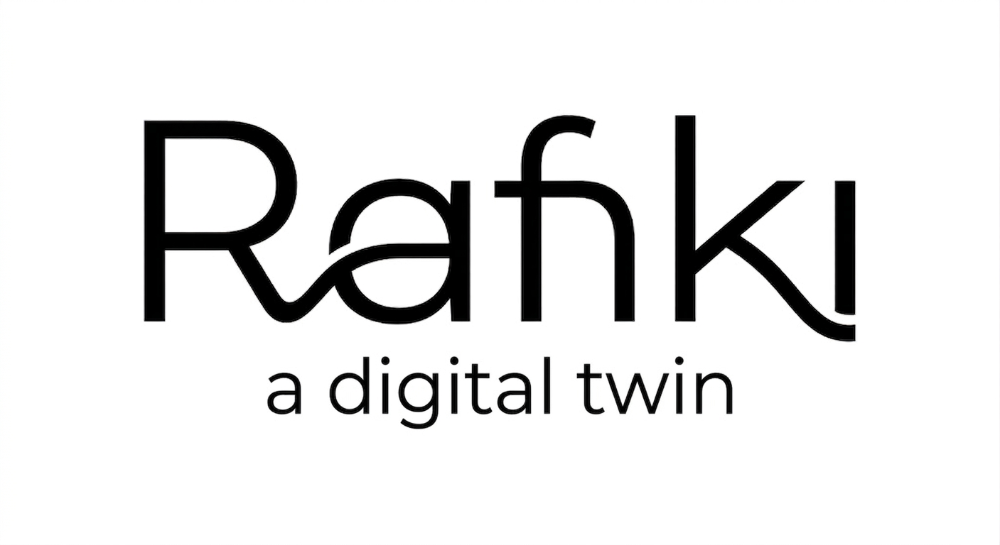

# Know Without Watching: Edge Digital Twinning with Rafiki

### *A 5-hour short course, first principles to techie*

&emsp;No background needed except basic computer literacy; every new word is defined where it first appears.

## How to use this course

&emsp;Read a module guide, open its interactive page in any browser (works from `file://`, no server), run its experiment from the module folder. Each experiment ships as a zip too, with its own README, scripts, and expected outputs inside. Print any HTML page to PDF from the browser.

## Modules

- [00 Orientation](00-orientation/guide.md) (15 min): setup, first run.
- [01 First principles](01-first-principles/guide.md) (30 min): the problem, the idea, the vocabulary.
- [02 Signals 101](02-signals/guide.md) (30 min): what phones measure.
- [03 Teka lab](03-teka-lab/guide.md) (30 min): acquisition in practice.
- [04 DSP core](04-dsp-core/guide.md) (40 min): windows, frequency, autocorrelation.
- [05 Chuja lab](05-chuja-lab/guide.md) (30 min): the feature walkthrough.
- [06 Baselines + cold start](06-baselines-cold-start/guide.md) (40 min): Welford, decay, stability math.
- [07 Convergence + anomalies](07-convergence-anomalies/guide.md) (30 min): spike labs.
- [08 Twin + assembly](08-twin-assembly/guide.md) (30 min): the full pipeline.
- [09 Field use](09-field-use/guide.md) (25 min): where this works, limits.
- [10 Capstone](10-capstone/guide.md) (20 min): your own regime + report.

## Branding

&emsp;Course pages carry the Rafiki logo above and credit ClerQ Intelligence (lead) with Nama Labs on every footer.
